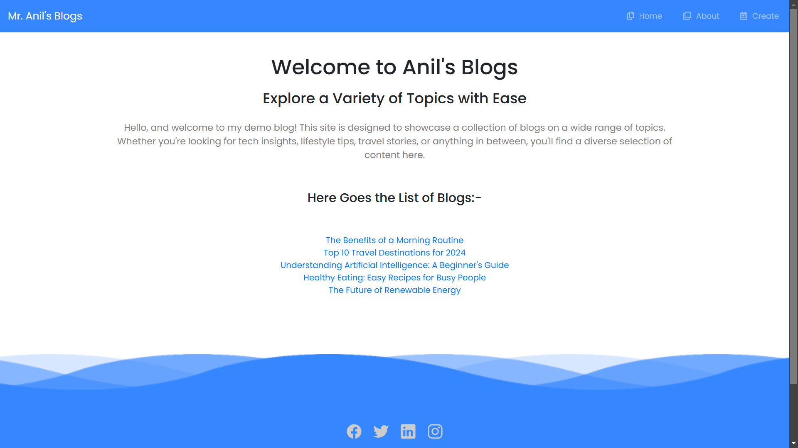

# 📝 Blog Web App  

## 📌 Overview  
This is a **dynamic blog web application** that allows users to **create, read, update, and delete (CRUD) blog posts**. It is built using **HTML, CSS, JavaScript, and a backend framework (Node.js / Django / Flask, etc.)**.  

## 🖼 Screenshot  
  

## 🚀 Features  
- ✍️ **Create New Blog Posts**  
- 📖 **Read and View Blog Entries**  
- ✏️ **Edit Existing Posts**  
- ❌ **Delete Unwanted Posts**  
- 🔍 **User-Friendly Interface**  

## 🛠 Installation  

1️⃣ Clone this repository:  
```bash
git clone <repo-url>
cd <repo-folder>
